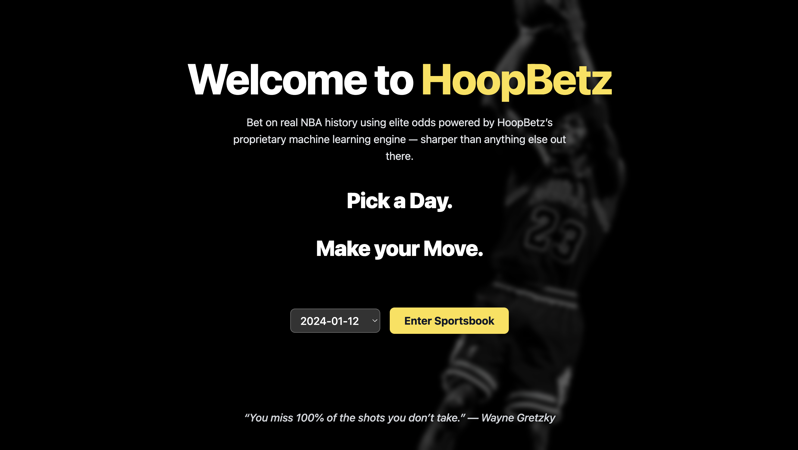
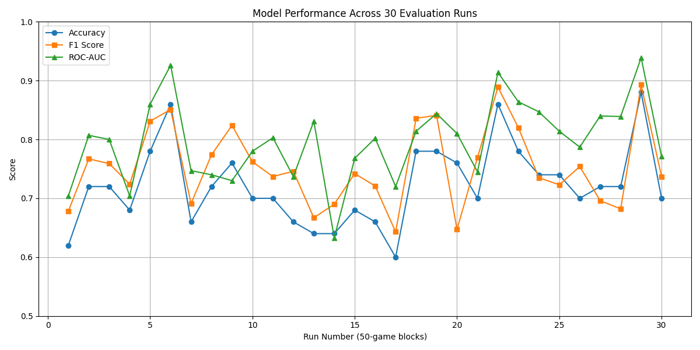

# HoopBetz 🏀💸 - ML-Driven-Full-Stack-Sports-Betting-Platform 
*An end-to-end, machine-learning-driven NBA sports-betting platform*

<details>
<summary><strong>Table&nbsp;of&nbsp;Contents</strong></summary>

1. [What is HoopBetz?](#what-is-hoopbetz)  
2. [Tech-stack](#tech-stack)  
3. [How to setup](#how-to-setup)  
4. [Data & ML Infrastructure](#data--ml-infrastructure)  
5. [Backend Architecture & API Design](#backend-architecture--api-design)  
6. [Frontend](#frontend)  
7. [Conclusion](#conclusion)  

</details>

---

## What is HoopBetz?
**HoopBetz** turns raw NBA game logs into actionable money-line odds, lets users log in with Google, place bets with mock currency, and track their wagers in real-time — all wrapped in a responsive, Tailwind-styled UI.

HoopBetz began as a lightweight proof‑of‑concept for serving ML‑generated NBA money‑line odds over a friendly web UI.  
It has since grown into a full‑blown betting experience:

- Modern, reactive front‑end that feels like a polished sportsbook
- In-depth data analysis and machine learning pipelines powering in-house money-line odds generation based on historical performance and advanced stats 
- Historical date selector → explore any game day since 2020
- Google OAuth 2.0 sign‑in & session management  
- Virtual wallet, bet slip, editable bet cards  
- Expandable to props / parlays thanks to a clean API boundary  
- 100% typed (FastAPI + Pydantic & React + TypeScript)

[](https://youtu.be/3cQdmrw7UJ8)

---

## Tech-stack


| **Layer / Domain** | **Technology (+ key packages)**         | **Version (typical)**     | **Role in HoopBetz**                               | **Notes / Rationale**                                 |
|--------------------|-----------------------------------------|----------------------------|----------------------------------------------------|--------------------------------------------------------|
| **Frontend**       | React (with Vite)                       | 18.x / Vite 5.x            | Core UI runtime & dev server                       | Vite = fast HMR & TypeScript support                   |
|                    | TypeScript                              | 5.x                        | Type-safe component code                           | Eliminates many runtime bugs                           |
|                    | Tailwind CSS                            | 3.x                        | Utility-first styling                              | Rapid responsive design                                |
|                    | Headless UI                             | 1.x                        | Accessible dialog & menu primitives                | Powers BetModal, Edit/Delete modals                    |
|                    | React Router DOM                        | 6.22 (“future flags”)      | Client-side routing                                | Nested routes: `/`, `/day/:dt`, `/my-bets`, etc.       |
| **State + UX**     | Custom BetContext (React Context + Reducer) | –                      | Tracks local bets, edit/delete                     | Pure client state until full user account system added |
| **Backend (API)**  | FastAPI                                 | 0.111.x                    | REST endpoints, OpenAPI docs                       | `/api/game-days`, `/api/odds`, `/auth/*`               |
|                    | Uvicorn + uvloop                        | 0.29.x                     | ASGI server                                        | `uvicorn backend.api.main:app --reload`                |
|                    | Authlib                                 | 1.x                        | OAuth 2 / OIDC flow                                | Wraps Google OAuth in `auth.py`                        |
|                    | itsdangerous                            | 2.x                        | Session signing (Starlette)                        | Required by `SessionMiddleware`                        |
|                    | pandas + numpy                          | 2.x / 2.x                  | Loads historical odds CSVs                         | Used in `/api/odds` route                              |
| **Data / ML**      | Pre-trained odds model outputs (CSV / Parquet) | –                   | Provide `ml_home`, `p_home`, etc.                  | Model itself can live in separate repo                 |
| **Auth / Identity**| Google Cloud OAuth 2.0 Client           | n/a                        | External IdP for “Sign in with Google”             | JavaScript origin: `http://localhost:5173`<br>Authorized redirect: `http://localhost:8000/auth/google/callback` |
| **Dev Tooling**    | Prettier / ESLint                       | latest                     | Code formatting & linting                          | Optional but recommended                               |
|                    | pyenv / virtualenv                      | 3.9+                       | Python version management                          | `.venv` activated before dev                           |
| **Testing**        | Jest + React Testing Library            | –                          | Component tests                                    | Snapshot & interaction tests                           |
|                    | Pytest                                  | –                          | API unit / integration tests                       | Use `httpx.AsyncClient` for FastAPI                    |
| **Deployment (future)** | Docker (+ docker-compose)         | n/a                        | Containerize frontend & backend                    | Multi-stage build → slim images                        |
|                    | (Cloud of choice)                       | –     
---

## How to setup

```bash
# 1. clone + cd
git clone https://github.com/your‑handle/hoopbetz.git
cd hoopbetz

# 2. backend ‑‑ Python 3.9‑3.11
python -m venv .venv
source .venv/bin/activate         # Windows: .venv\Scripts\activate
pip install -r backend/requirements.txt

# 3. frontend
cd frontend
npm i       # or `pnpm i` / `yarn`

# 4. copy env template and paste your Google creds
cp .env.sample .env
# → edit .env with your GOOGLE_CLIENT_ID / SECRET

# 5. two terminals
# ── terminal A ──
uvicorn backend.api.main:app --reload

# ── terminal B ──
npm run dev            # default http://localhost:5173
```
---


## Data & ML Infrastructure

A breakdown of every data and ML-related layer used in HoopBetz, including tooling, responsibilities, and rationale for each decision.

| **Layer / Domain**          | **Technology (+ key packages)**                      | **Version (typical)**     | **Role in HoopBetz**                                                                 | **Notes / Rationale**                                                                 |
|-----------------------------|------------------------------------------------------|----------------------------|--------------------------------------------------------------------------------------|----------------------------------------------------------------------------------------|
| **Data / ML – Ingestion**   | Python ETL scripts (`pandas 2.x`, `requests`, `httpx`) | –                        | Nightly job downloads NBA box scores, betting lines, and injury reports → dumps clean Parquet files to `/data/raw/YYYY-MM-DD/` | Simple cron or GitHub Action; Parquet retains type fidelity and compression            |
|                             | Pre-made season data files (CSV/Parquet)        | –                          | Provides historical team and game-level data with advanced stats                     | Includes offensive/defensive ratings, ELO, net rating, true shooting %, and more      |
| **Feature Store**           | Feast                                                | 0.37                       | Versioned feature registry (per season)                                              | Allows both model training and API to consume the same feature sets offline & online  |
| **Modeling / Training**     | XGBoost                                              | 2.x                        | Gradient-boosted probability model (`p_home`, `p_away`)                              | Ideal for tabular sports data; fast training with interpretable SHAP values           |
|                             | scikit-learn                                         | 1.5                        | Pipeline wrapper, `GridSearchCV` for hyperparameter tuning                           | Reproducible transforms → exported as Parquet artifacts                               |
|                             | MLflow                                               | 2.x                        | Experiment tracking and model registry                                               | Each run tagged with Git SHA and data snapshot ID                                     |
| **Batch Scoring**           | Airflow DAG (`Celery` executor)                     | 2.9                        | After training, score every matchup in season → generate `ml_home`, `ml_away` CSV    | Outputs dropped into `backend/data/odds_<season>.csv`, consumed by `/api/odds`       |
| **Model Serving (future)**  | FastAPI micro-service with `onnxruntime`            | 0.111 / 1.18               | Serve real-time odds predictions during live season                                  | Keeps main API lean; model weights can auto-refresh via MLflow registry              |


---


## Model Evaluation Summary

To rigorously assess our machine learning model's ability to predict NBA game outcomes, we conducted **30 rolling evaluations** using 50-game blocks from the 2021–2024 seasons.

Each run provides key classification metrics and a confusion matrix, helping us analyze performance over time and detect trends or inconsistencies.

---

### Average Performance Across 30 Runs

| **Metric**    | **Average** | **Std. Deviation** | **Definition**                                                                 |
|---------------|-------------|--------------------|---------------------------------------------------------------------------------|
| Accuracy      | 0.722       | ± 0.069            | Percentage of correct predictions across all games                             |
| Precision     | 0.729       | ± 0.091            | Proportion of predicted winners that were correct (`TP / (TP + FP)`)           |
| Recall        | 0.789       | ± 0.078            | Proportion of actual winners correctly predicted (`TP / (TP + FN)`)            |
| F1 Score      | 0.754       | ± 0.068            | Harmonic mean of Precision and Recall; balances false positives and negatives  |
| ROC-AUC       | 0.797       | ± 0.069            | Measures the model's ability to distinguish between classes (closer to 1 = better) |

These metrics indicate a **well-performing binary classifier**, with especially strong recall and ROC-AUC scores—suggesting the model captures most winners and separates classes effectively.

To better understand the evolution of our model’s performance across the 30 evaluation runs, we generated a visual comparison of the three most critical metrics: **Accuracy**, **F1 Score**, and **ROC-AUC**.

#### Visual Summary – 30 Evaluation Blocks



> Each point on the graph represents the performance of the model on a 50-game rolling block between 2021 and 2024.

#### What the graph shows:

- **Accuracy** reflects how often the model correctly predicted the winning team
- **F1 Score** balances precision and recall — key for avoiding misleading predictions
- **ROC-AUC** demonstrates the model’s ability to distinguish between the winning and losing teams

The model shows:
- Consistent **accuracy above 70%** for most blocks
- Strong **F1 scores**, indicating balance in prediction quality
- Excellent **ROC-AUC**, often exceeding 0.80, proving good discrimination between classes

---

### Why the HoopBetz Model Performs So Well

The success of the HoopBetz model lies in its **depth of features** and **context-aware design**. Unlike traditional models that rely on simplistic win/loss trends or aggregated stats, HoopBetz leverages a **rich, multi-dimensional feature set** for each game.

#### Key Factors Behind Model Performance:

- **Player vs. Opponent Stats**  
  Incorporates how specific players historically perform against certain teams and defensive schemes.

- **Player vs. Player Matchups**  
  Captures micro-dynamics between star matchups (e.g., guards guarding guards), not just team-level data.

- **Team vs. Team History**  
  Accounts for recurring trends in team clashes — rivalries, blowouts, upsets — over multiple seasons.

- **Injury Reports & Substitutions**  
  Real-time updates on player injuries and rotations drastically impact outcome probabilities.

- **Player Slumps & Hot Streaks**  
  Considers recent form, usage rate changes, and shooting efficiency over trailing 5–10 games.

- **Location Context**  
  Home-court advantage, travel fatigue, time-zone shifts, and back-to-back games all factor into predictions.

- **Dozens More**  
  Including pace of play, offensive/defensive rating deltas, foul trends, shot location efficiency, and adjusted ELO.

This detailed, context-aware approach allows the model to go **far beyond the capabilities of betting lines or Elo-only systems**, producing predictions that are **statistically sound and situationally intelligent**.

---


###  How Does HoopBetz Compare to Real-World Sportsbooks?

While most commercial sportsbooks (e.g., DraftKings, FanDuel, Bet365) **do not publicly disclose** the accuracy or precision of their prediction models, industry estimates and published research provide benchmarks that help contextualize HoopBetz’s performance.

| **Platform**       | **Estimated Win Prediction Accuracy** | **Notes**                                                                 |
|--------------------|----------------------------------------|---------------------------------------------------------------------------|
| **HoopBetz**       | 72.2% (± 6.9%)                         | Based on 30 ML evaluation runs (2021–2024 NBA games)                      |
| Vegas Lines (Implied) | ~69–71%                            | Inferred from betting odds and closing line evaluations                   |
| Academic Models    | 65–75%                                 | Depending on model complexity, feature richness, and data window size     |
| ESPN BPI (internal) | Not published                         | Used for projection but lacks transparency or model reproducibility       |
| FiveThirtyEight (Elo-based) | ~68–72%                     | Public models based on Elo ratings and pace-adjusted metrics              |

**What sets HoopBetz apart:**

- Transparent and reproducible pipeline  
- Full access to evaluation metrics (F1, ROC-AUC, confusion matrices)  
- Trained on actual historical odds, injuries, and advanced stats  
- Provides **model confidence** (e.g., `p_home`, `p_away`) rather than just raw picks  
- Designed to serve real-time model-backed betting experiences (not just predictions)

---

## Backend Architecture & API Design

The backend of HoopBetz is built with **FastAPI**, a modern Python web framework known for its speed, automatic documentation, and native support for async programming. It acts as the backbone of the application—managing authentication, serving predictions, routing requests, and simulating betting markets.

### Technologies Used

| **Component**      | **Technology**         | **Purpose**                                                               |
|--------------------|------------------------|---------------------------------------------------------------------------|
| Web Framework      | FastAPI                | High-performance async API server with automatic docs (Swagger/OpenAPI)  |
| ASGI Server        | Uvicorn                | Production-ready server to host FastAPI apps                             |
| Auth Middleware    | Authlib + python-jose  | Secure Google OAuth 2.0 login and JWT token handling                     |
| Odds Engine        | Custom market maker    | Generates probability-based moneyline odds from model output             |
| Data Serving       | pandas / numpy         | Loads and transforms pre-scored ML output (e.g., `odds_2023.csv`)        |
| Environment Mgmt   | Python `.env` + Pydantic | Centralized config and secure key injection                             |

---

### Backend Files Overview

| **File**           | **Role**                                                                 |
|--------------------|--------------------------------------------------------------------------|
| `main.py`          | Initializes the FastAPI app, includes router registration and CORS setup |
| `auth.py`          | Handles Google OAuth 2.0 login, session management, and JWT creation     |
| `routes.py`        | API endpoints: `/game-days`, `/odds`, and dynamic props routing          |
| `make_market.py`   | Generates American-style moneyline odds based on model probabilities     |
| `odds_tester.py`   | Utility script to test odds formatting and probability edge cases        |

---

### Authentication System

HoopBetz uses **Google OAuth 2.0** via the `Authlib` and `python-jose` libraries.

- When a user signs in with Google, their credentials are verified and converted into a signed **JWT token**.
- JWT is stored client-side and used for subsequent API calls.
- Session support is enabled with `SessionMiddleware` and token verification guards.

---

## Frontend

The HoopBetz frontend is a sleek, responsive Single Page Application (SPA) built with a modern React + Vite + TypeScript stack. It delivers a fast, dynamic, and sportsbook-style betting experience with clean UI, smooth UX flows, and full support for stateful interactions — all without requiring a backend round-trip for most UI events.

### Technologies Used

- **React 18.x** with **Vite 5.x** for rapid development, fast hot module replacement, and a modern tooling experience.
- **TypeScript 5.x** for static typing and safer code, minimizing runtime errors.
- **Tailwind CSS 3.x** enables utility-first styling for a responsive and polished UI.
- **React Router DOM 6.22 (future flags)** to manage nested routes like `/`, `/day/:dt`, `/my-bets`, and `/wallet`.
- **Headless UI 1.x** for accessible and reusable dialog and transition components, used across modals.
- **uuid 9.x** to generate unique client-side IDs for temporary bets.

### State Management

State is managed via a custom `React.Context` and `useReducer` setup (`BetContext` and `WalletContext`) — giving localized state management for user-placed bets, wallet balances, edit/delete modals, and more. This architecture enables a future upgrade to full user account storage via a backend.

### Key Pages & Components

- **Landing.tsx**: Homepage with call-to-action and onboarding.
- **Login.tsx**: OAuth2-based Google sign-in and auth redirect.
- **OddsDashboard.tsx**: Core betting interface showing ML-generated odds for the selected game day.
- **PropsPage.tsx**: Displays all bets placed, with options to edit or cancel each. Modals powered by Headless UI and styled with Tailwind.
- **Wallet.tsx**: Manages user bankroll with mock deposits/withdrawals, transaction history, and wallet metrics.
- **MyBets.tsx**: Bet history overview and tracking.
- **api.ts**: Centralized API utility to fetch odds, game days, and handle auth tokens securely.

### UI & UX Enhancements

- **Backdrop blur**, gradients, and hover transitions for a polished aesthetic.
- **Modal-driven editing & confirmation flows** for intuitive user interaction.
- **Live payout calculations** on odds change or stake modification.
- **Responsive grid layouts** for bet cards and dashboards across devices.
- **Custom wallet system** that simulates deposits, tracks locked funds, and shows real-time balance effects.

---

The frontend is designed to be modular and extensible — easily adaptable to real-money platforms, support for props/parlays, or mobile-first design. Every interaction is optimized to be smooth, intentional, and data-driven.

---

## Conclusion

HoopBetz represents a fully integrated, end-to-end NBA betting platform — combining the power of machine learning, real-time data analysis, and modern web development into a clean and production-ready experience.

From **ML-driven odds generation** to a **reactive front-end sportsbook**, every part of the stack has been carefully designed for:

-  **Transparency** — Open source model evaluation, confusion matrices, and metric breakdowns
-  **Intelligence** — In-depth feature engineering and context-aware predictions (injuries, matchups, slumps, etc.)
-  **Scalability** — Clean API boundaries, typed interfaces, and containerized deployment pathways
-  **User Experience** — Smooth UI flows, instant feedback, and wallet tracking with bet slip editing

Whether you're placing a bet, exploring historical game days, or analyzing model performance — HoopBetz offers a **data-first, user-focused betting simulation** with real engineering behind the scenes.

With modular ML pipelines, feature-rich state management, and full API coverage, HoopBetz is **not just a demo** — it’s a blueprint for building smarter, fairer, and more informative sports betting systems.

---


